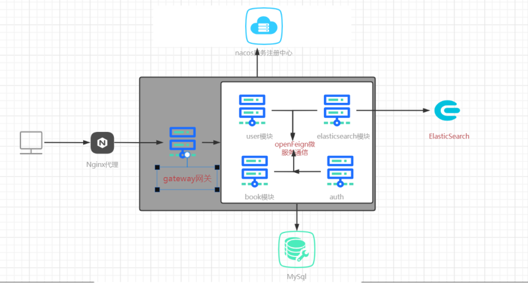

# 项目架构
```
library
├── book-comment -- 工具类及通用代码模块
├── book-generator -- MyBatisPluse Generator生成的数据库操作代码模块
├── book-auth-security -- 基于Spring Security Oauth2的统一的认证中心
├── book-gateway -- 基于Spring Cloud Gateway的微服务API网关服务
├── book-search -- 基于Elasticsearch的商品搜索系统服务
├── book-test -- 微服务远程调用测试服务
└── book-member -- 用户管理服务中心
```
# 项目介绍
```
利用spring security + Oauth2协议实现权限验证和鉴定  在spring Boot+Vue2框架基础上实现前后端分离   
nginx + spring gateway网关实现反向代理机制  spring session+redis（分布式session存储）实现单点登录功能    
elasticsearch实现书籍的快速搜索功能  基于mysql8.0实现数据持久化存储管理和事务访问机制

spring session + spring redis : 分布式session 

spring security ：鉴权服务器

jwt（json web token） :  储存信息

elasticsearch ： 分布式、高扩展、高实时的搜索与 数据分析 引擎

spring boot + spring cloud ： 微服务开发

mybatis-plus : 操作数据库功能的代码工具

nacos : 服务注册于配置中心

openfeign：声明式服务调用组件

threaPool + Completable:线程池 + 异步调用
```

# 项目架构图片


# 项目搭建
```
switchHost配置library.com 映射 127.0.0.1（本地ip）路径，实现域名访问
192.168.0.6 library.com
192.168.0.6 book.library.com
192.168.0.6 auth.library.com
192.168.0.6 search.library.com
利用nginx反向代理到gateway网关
```

# 项目技术
| 技术                   | 说明                | 官网                                             |
| ---------------------- | ------------------- | ------------------------------------------------ |
| Spring Cloud           | 微服务框架          | https://spring.io/projects/spring-cloud          |
| Spring Cloud Alibaba   | 微服务框架          | https://github.com/alibaba/spring-cloud-alibaba  |
| Spring Boot            | 容器+MVC框架        | https://spring.io/projects/spring-boot           |
| Spring Security Oauth2 | 认证和授权框架      | https://spring.io/projects/spring-security-oauth |
| MyBatis Plus           | ORM框架             | http://www.mybatis.org/mybatis-3/zh/index.html   |
| MyBatis Plus Generator | 数据层代码生成      | http://www.mybatis.org/generator/index.html      |
| PageHelper             | MyBatis物理分页插件 | http://git.oschina.net/free/Mybatis_PageHelper   |
| Elasticsearch          | 搜索引擎            | https://github.com/elastic/elasticsearch         |
| Redis                  | 分布式缓存          | https://redis.io/                                |
| Druid                  | 数据库连接池        | https://github.com/alibaba/druid                 |
| JWT                    | JWT登录支持         | https://github.com/jwtk/jjwt                     |
| Lombok                 | 简化对象封装工具    | https://github.com/rzwitserloot/lombok           |

|      |
| ---- |


